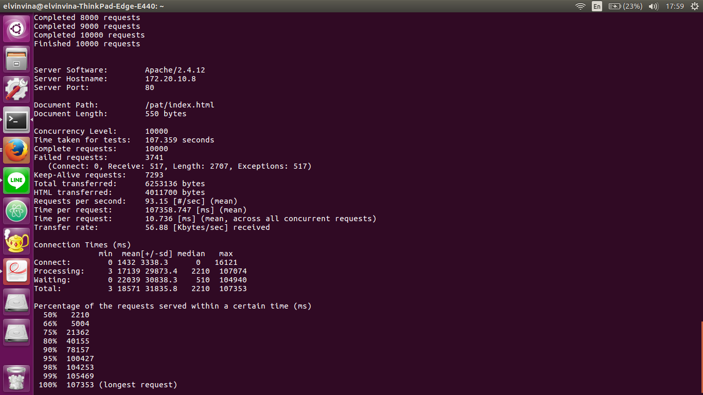
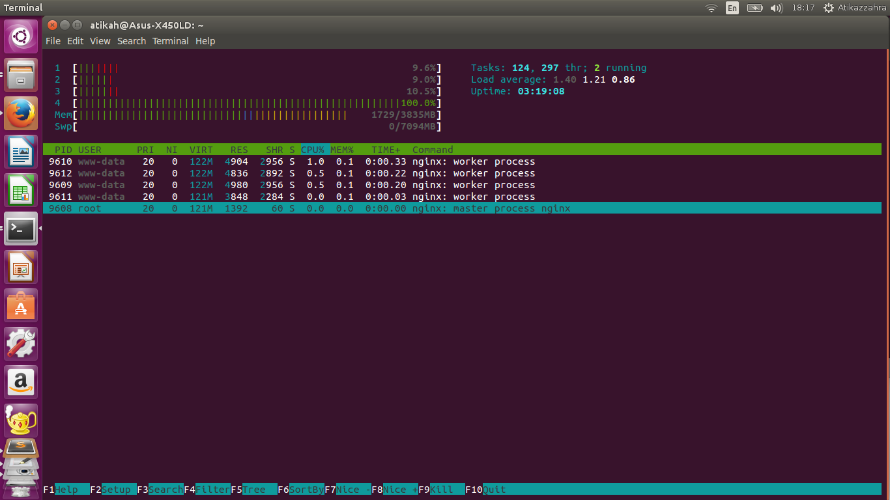

# PAT- Simple Eventbased Webserver

## Mengukur Kinerja Web Server

Pada tugas ini dilakukan dua percobaan yaitu melakukan 10.000 request konkuren sebuah dokumen HTML berukuran kurang lebih 500 bytes, dan dokumen HTML berukuran kurang lebih 20 KB. Percobaan dilakukan pada tiga jenis server yaitu Web server Apache, Web Server Nginx, dan Web Server sederhana dengan pendekatan event-based.

### Tool Benchmark

Kakas yang digunakan untuk percobaan adalah ApacheBench (ab). Sebuah program open source yang dikembangkan untuk mengukur kinerja HTTP web server. ApacheBench termasuk dalam Apache Web Server sehingga tidak perlu diinstal secara terpisah.

Berikut adalah penggunaan ApacheBench pada percobaan:

```
ab -n x -c y [http[s]://]hostname[:port]/path
```
Dimana,
* n x : ab akan mengirim x request kepada server
* c y : ab akan mengirim y request pada saat yang sama setiap waktunya


Maka untuk melakukan pengukuran kinerja pelayanan 10.000 request konkuren ApacehBench dipanggil seperti dibawah ini:

```
ab -n 10000 -c 10000 http[s]://]hostname[:port]/path
```

Sedangkan untuk mengukur memory usage, dilakukan monitoring memory usage secara real time menggunakan htop pada lingkungan server.

## Hasil Percobaan

Percobaan dilakukan pada lingkungan Ubuntu menggunakan dua laptop. Laptop pertama bertugas sebagai server dan laptop kedua bertugas sebagai pengirim request. Memory usage diukur pada lingkungan server yaitu pada laptop pertama.

### Apache2

* Berikut adalah hasil yang didapatkan saat mengakses dokumen HTML berukuran 500 bytes:




Didapatkan bahwa rata-rata respons setiap request adalah sebesar 18,571 ms dan Memory usage proses yang dibangkitkan oleh web server Apache untuk melayani setiap requestnya adalah sebesar 0.2 % dari total memory.


* Berikut adalah hasil yang didapatkan saat mengakses dokumen HTML berukuran 20 kilobytes:


Didapatkan bahwa rata-rata respons setiap request adalah sebesar 56,289 ms dan Memory usage proses yang dibangkitkan oleh web server Apache untuk melayani setiap requestnya adalah sebesar 0.2 % dari total memory.


### Nginx

* Berikut adalah hasil yang didapatkan saat mengakses dokumen HTML berukuran 500 bytes:




Didapatkan bahwa rata-rata respons setiap request adalah sebesar 7,502 ms dan Memory usage proses yang dibangkitkan oleh web server Apache untuk melayani setiap requestnya adalah sebesar 0.1 % dari total memory.


* Berikut adalah hasil yang didapatkan saat mengakses dokumen HTML berukuran 20 kilobytes:


Didapatkan bahwa rata-rata respons setiap request adalah sebesar 92,689 ms dan Memory usage proses yang dibangkitkan oleh web server Apache untuk melayani setiap requestnya adalah sebesar 0.1 % dari total memory.


### Simple Event-based Web Server 

* Berikut adalah hasil yang didapatkan saat mengakses dokumen HTML berukuran 500 bytes:


Didapatkan bahwa rata-rata respons setiap request adalah sebesar 55,653 ms dan Memory usage proses yang dibangkitkan oleh web server Apache untuk melayani setiap requestnya adalah sebesar 12.4 % dari total memory.


* Berikut adalah hasil yang didapatkan saat mengakses dokumen HTML berukuran 20 kilobytes:


Didapatkan bahwa rata-rata respons setiap request adalah sebesar 129,191 ms dan Memory usage proses yang dibangkitkan oleh web server Apache untuk melayani setiap requestnya adalah sebesar 12.4 % dari total memory.


## Instalasi dan Cara Penggunaan Simple Event-based Web Server 

Simple Event-based Web Server dibangun dengan bahasa C menggunakan socket dan library libev. Untuk percobaan ini, server hanya dapat menerima request file dengan extension HTML.

Kompilasi program dengan menjalankan Makefile

```
make
``` 
Untuk menjalankan server

```
./server [port] [lokasi file html] [& - menjalankan server sebagai background process]
```

Pada percobaan ini, telah disediakan file untuk serving yaitu pada folder html yang berisi dua file HTML berukuran 500 bytes (index.html) dan 20 KB (index2.html) sehingga pada defaultnya server dijalankan seperti berikut:

```
./server [port] ./html [& - menjalankan server sebagai background process]
```

## Oleh

* Elvina R. K. Situmorang - 13514045
* Atika Azzahra Akbar - 13514077

## Referensi

* http://codefundas.blogspot.co.id/2010/09/create-tcp-echo-server-using-libev.html
* https://github.com/labcoder/simple-webserver
